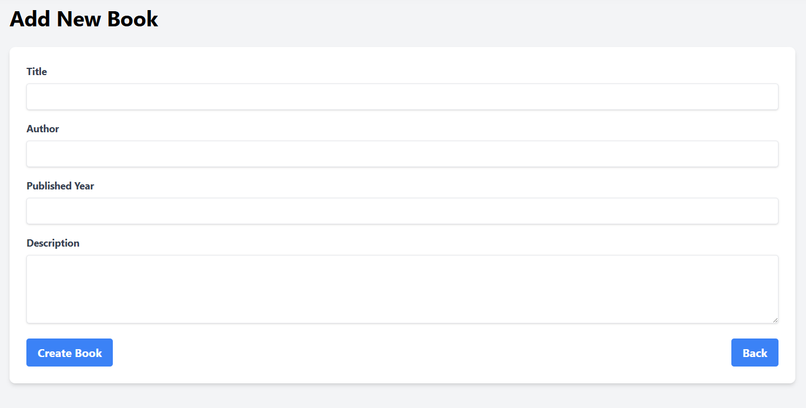
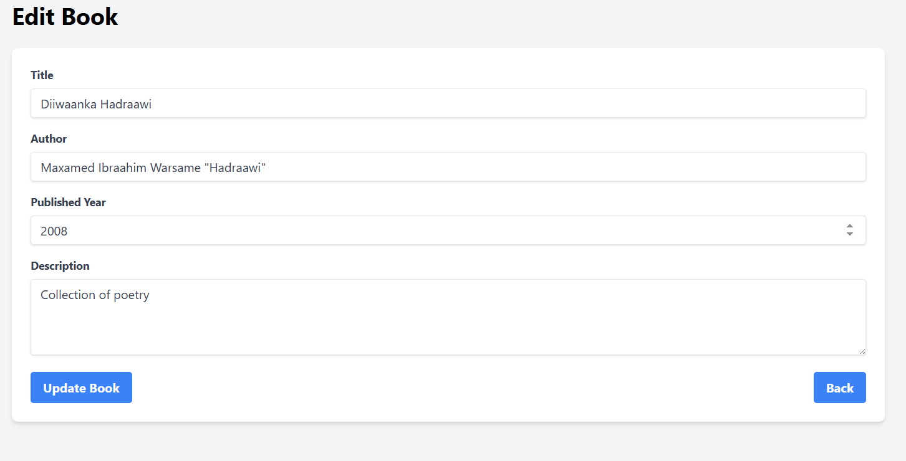
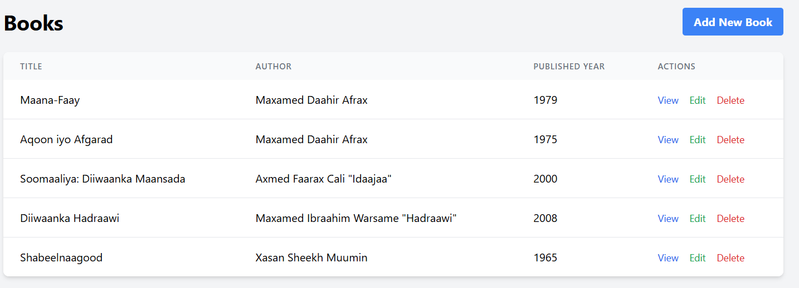

# Laravel Book Library Project

A modern book library management system built with Laravel 10, featuring a clean and responsive UI with Tailwind CSS.

## Features

- Complete CRUD operations for books
- Form validation with Laravel's FormRequest
- Responsive design with Tailwind CSS
- Clean and maintainable code structure
- User-friendly interface with confirmation dialogs

## Installation

1. Clone the repository
```bash
git clone <repository-url>
cd book-library
```

2. Install dependencies
```bash
composer install
npm install
```

3. Configure environment
```bash
cp .env.example .env
php artisan key:generate
```

4. Configure your database in `.env` file
```
DB_CONNECTION=mysql
DB_HOST=127.0.0.1
DB_PORT=3306
DB_DATABASE=book_library
DB_USERNAME=root
DB_PASSWORD=
```

5. Run migrations
```bash
php artisan migrate
```

6. Start the development server
```bash
php artisan serve
```

## Route List

```
+--------+-----------+-------------------------+------------------+------------------------------------------------+------------+
| Domain | Method    | URI                    | Name             | Action                                         | Middleware |
+--------+-----------+-------------------------+------------------+------------------------------------------------+------------+
|        | GET|HEAD  | /                      |                  | Closure                                        | web        |
|        | GET|HEAD  | books                  | books.index      | App\Http\Controllers\BookController@index      | web        |
|        | POST      | books                  | books.store      | App\Http\Controllers\BookController@store      | web        |
|        | GET|HEAD  | books/create           | books.create     | App\Http\Controllers\BookController@create     | web        |
|        | GET|HEAD  | books/{book}           | books.show       | App\Http\Controllers\BookController@show       | web        |
|        | PUT|PATCH | books/{book}           | books.update     | App\Http\Controllers\BookController@update     | web        |
|        | DELETE    | books/{book}           | books.destroy    | App\Http\Controllers\BookController@destroy    | web        |
|        | GET|HEAD  | books/{book}/edit      | books.edit       | App\Http\Controllers\BookController@edit       | web        |
+--------+-----------+-------------------------+------------------+------------------------------------------------+------------+
```

## Screenshots

### Create Book Form

*The create book form with validation and error handling*

### Edit Book Form

*Edit form with pre-populated data and validation*

### Delete Confirmation

*Delete confirmation dialog for safe book removal*

## Learning Summary

During the development of this project, several key Laravel concepts and best practices were implemented:

1. **Model-View-Controller (MVC) Architecture**
   - Created a well-structured Book model with proper attributes
   - Implemented a resource controller with RESTful actions
   - Designed clean and reusable Blade views

2. **Form Handling & Validation**
   - Used FormRequest for centralized validation rules
   - Implemented proper error handling and display
   - Added CSRF protection and old input preservation

3. **Database Operations**
   - Created migrations for database structure
   - Used factories for test data generation
   - Implemented proper model relationships

4. **Frontend Development**
   - Integrated Tailwind CSS for responsive design
   - Created a consistent and user-friendly interface
   - Implemented proper form validation feedback

5. **Laravel Best Practices**
   - Used route model binding for cleaner controller methods
   - Implemented proper redirect responses with flash messages
   - Followed Laravel naming conventions and coding standards

## Next Steps

- Implement user authentication
- Add book categories and tags
- Create an API for mobile applications
- Add book cover image upload functionality
- Implement book search and filtering


